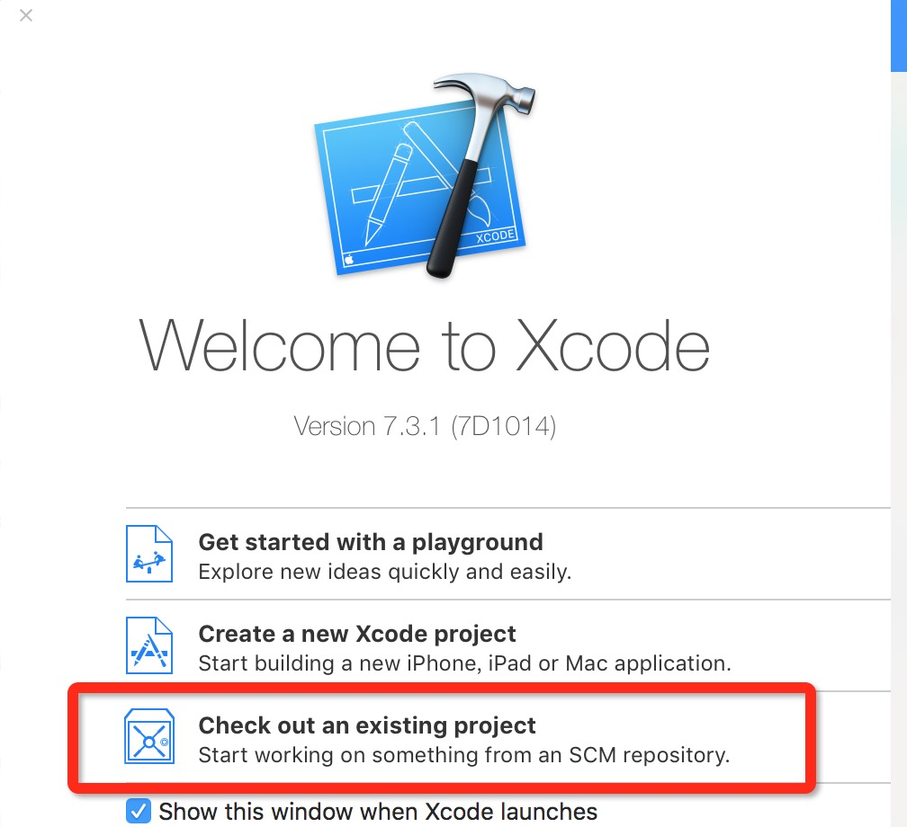
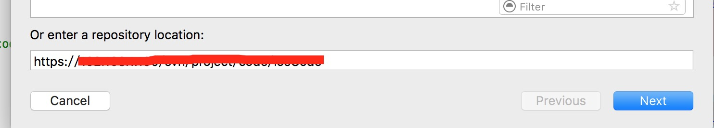
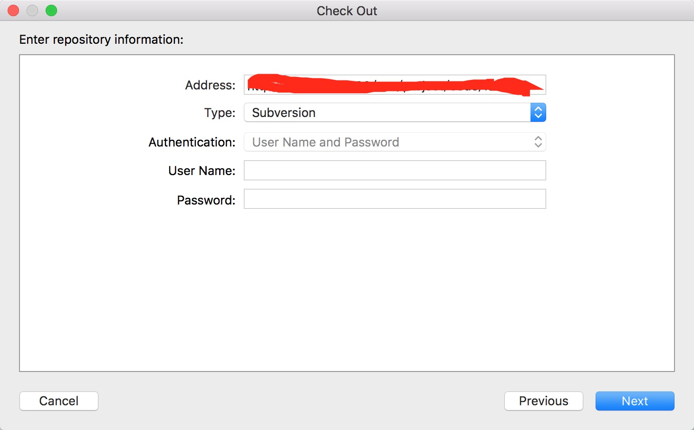
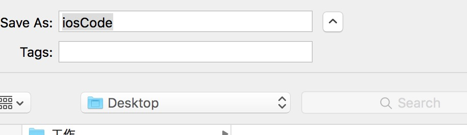
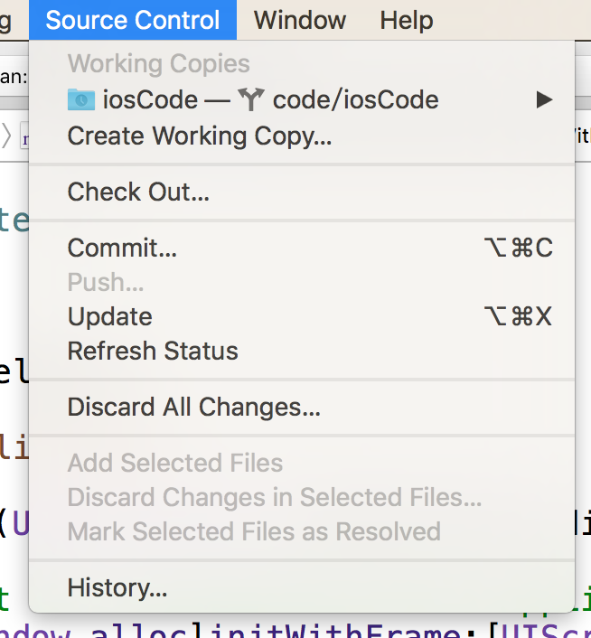

#SVN自学笔记  

##使用svn客户端功能    
###1.从本地导入代码到服务器(第一次初始化导入)

在终端中输入

	svn import /Users/apple/Documents/eclipse_workspace/weibo svn://localhost/mycode/weibo --username=mj --password=123 -m "初始化导入"
	
	svn://localhost/mycode/weibo 替换成公司svn服务器给的地址,username和password为公司给的账号和密码

我解释下指令的意思：将/Users/apple/Documents/eclipse_workspace/weibo中的所有内容，上传到服务器mycode仓库的weibo目录下，后面双引号中的"初始化导入"是注释  
  
###2.从服务器端下载代码到客户端本地  
在终端中输入

	svn checkout svn://localhost/mycode --username=mj --password=123 /Users/apple/Documents/code
	svn checkout 公司SVN服务器地址 --username=mj --password=123 目标地址

我解释下指令的意思：将服务器中mycode仓库的内容下载到/Users/apple/Documents/code目录中  
  
###3.提交更改过的代码到服务器

在步骤2中已经将服务器端的代码都下载到/Users/apple/Documents/code目录中，现在修改下里面的一些代码，然后提交这些修改到服务器

	1> 打开终端，先定位到/Users/apple/Documents/code目录，输入：cd /Users/apple/Documents/code

	2> 输入提交指令：svn commit -m "注释"  
  
###4.更新服务器端的代码到客户端

这个应该是最简单的指令了，在终端中定位到客户端代码目录后，比如上面的/Users/apple/Documents/code目录，然后再输入指令：
	
	svn update  
  
---
原文来自mj大神:[link](http://www.cnblogs.com/mjios/archive/2013/03/10/2952258.html)    
  
#Xcode上SVN的checkout,update,commit操作      
###第一次提交到服务器仍需要使用上面的命令行指令.  
##一,从SVN服务器Checkout项目
###1.打开Xcode,选择checkout

###2.填SVN地址  
  
###3.输入账号,密码
  
###4.选择输出路径,ok  
    
##二,commit和update    
###commit 提交.
###update 与服务器同步.

